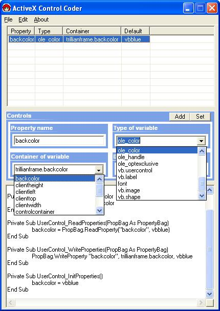



## OCX Control Coder 2

### Description

Tired of coding in the property let/get and the read/write properties for ActiveX controls? This does it for you, then adds the code to the control file. Uses an intellisense clone to enter container variables, and variable types. Assimilates your control file to obtain the values. These advanced features were added cause a certain user felt moving my command buttons around meant he could submit my code with his name on it.
 
### More Info
 

             |
---                |---
**Submitted On**   |2004-04-21 12:54:22
**By**             |[Techni Rei Myoko](https://github.com/Planet-Source-Code/PSCIndex/blob/master/ByAuthor/techni-rei-myoko.md)
**Level**          |Advanced
**User Rating**    |4.3 (43 globes from 10 users)
**Compatibility**  |VB 6\.0
**Category**       |[Complete Applications](https://github.com/Planet-Source-Code/PSCIndex/blob/master/ByCategory/complete-applications__1-27.md)
**World**          |[Visual Basic](https://github.com/Planet-Source-Code/PSCIndex/blob/master/ByWorld/visual-basic.md)
**Archive File**   |[OCX\_Contro1736084212004\.zip](https://github.com/Planet-Source-Code/techni-rei-myoko-ocx-control-coder-2__1-53276/archive/master.zip)

